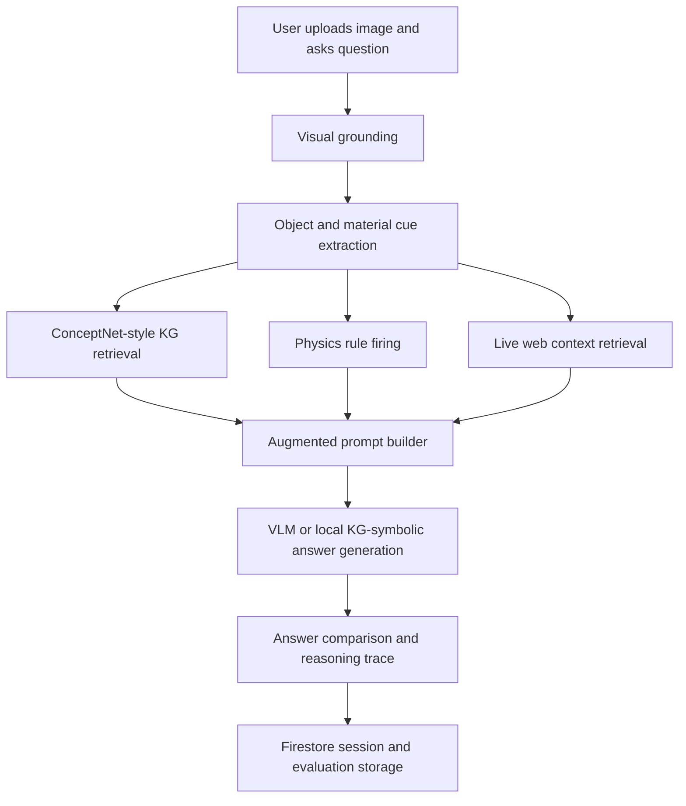

# VLM Reasoning Model using Knowledge Graph

An AI-powered Firebase web application that improves Visual Language Model (VLM) physical-world reasoning with Knowledge Graph retrieval, physics rules, live web context, and evaluation-driven answer comparison.

Live app: https://vlm-reasoning-model-b760f.web.app

Repository: https://github.com/tirth1263/VLM-Reasoning-Model-using-Knowledge-Graph

## Project Overview

Modern VLMs can describe images well, but they often fail when a question requires physical reasoning: material properties, cause and effect, shadows, elasticity, conductivity, heat transfer, buoyancy, gravity, or object interactions. This project addresses that weakness by adding an inference-time reasoning layer around the VLM.

Instead of asking the model to answer from the image alone, the app builds a grounded reasoning context:

1. Detects physical objects and material cues from the image, image filename, scene notes, and question.
2. Retrieves ConceptNet-style facts related to the detected objects.
3. Applies hand-written physics rules for common physical-world reasoning categories.
4. Retrieves web context from Wikipedia when local knowledge is not enough.
5. Generates context-related questions to make the reasoning process explicit.
6. Builds baseline and knowledge-augmented prompts.
7. Compares plain VLM answers against KG-enhanced answers.
8. Stores sessions, uploaded images, and evaluation runs with Firebase.

The goal is to make image-question answering more accurate, explainable, and grounded in real physical knowledge.

## Core Objective

The main objective is:

> Improve VLM physical-world reasoning using Knowledge Graph augmentation.

The app is designed for questions like:

- Which object will break when dropped?
- Why is copper used in electrical wiring?
- Which material conducts heat better?
- Where will a shadow fall?
- Will this object float or sink?
- Which object is attracted by a magnet?
- What physical property explains the observed behavior?

## Key Features

- Google sign-in using Firebase Authentication.
- Firestore persistence for reasoning sessions and evaluation results.
- Firebase Storage upload path for reasoning images.
- Firebase AI Logic VLM mode for multimodal image grounding and answer generation.
- Local KG-symbolic fallback when cloud AI is unavailable.
- ConceptNet-style physical fact retrieval.
- Physics rule engine for elasticity, heat, gravity, buoyancy, reflection, shadows, magnetism, and insulation.
- Web context retrieval from Wikipedia for broader context and less template-bound answers.
- Context-related question generation.
- Baseline versus KG-augmented answer comparison.
- Ablation lab with report-inspired evaluation conditions.
- Responsive UI with light, dark, and default themes.
- Session history and knowledge graph explorer.

## Reasoning Pipeline



## Model Components

### 1. Visual Grounding

The app grounds the uploaded image using:

- Firebase AI Logic VLM output when enabled.
- Image filename cues.
- Optional user scene notes.
- Question text.
- Local physical vocabulary extraction.

This produces a set of physical objects and materials used by the retrieval and rule systems.

### 2. Knowledge Graph Retrieval

The app includes a ConceptNet-style physical knowledge base with facts such as:

- Glass has the property brittle and likely to shatter.
- Copper is used for conducting electricity.
- Plastic has the property electrical insulator.
- Wood can float on water.
- Magnets attract iron and steel.

Facts are ranked by lexical and semantic overlap with the question and detected objects.

### 3. Physics Rule Engine

The rule engine fires domain rules such as:

- Glass is brittle and tends to shatter.
- Rubber is elastic and bounces after deformation.
- Shadows fall opposite the light source.
- Heat flows from hotter objects to colder objects.
- Denser solid objects usually sink in water.
- The angle of reflection equals the angle of incidence.

These rules help the model reason beyond surface-level image labels.

### 4. Web Context Retrieval

To avoid relying only on the fixed local knowledge base, the app can retrieve external context from Wikipedia. The query is built from:

- The user's question.
- Detected image objects.
- Scene description.
- Physical property intent.

Retrieved web snippets are injected into the augmented prompt and displayed in the reasoning trace. This helps the model answer broader context questions and makes the system less dependent on memorized templates.

### 5. Firebase AI and Local Fallback

The app supports Firebase AI Logic for VLM grounding and answer generation. If Firebase AI returns an empty response, times out, or is unavailable, the app falls back to the local KG-symbolic reasoner so the user still receives an answer.

## Evaluation Methodology

The Ablation Lab follows the project report methodology:

| Condition | Purpose |
| --- | --- |
| Baseline | VLM/question-only answer without KG |
| Random KG | Control test showing irrelevant knowledge can hurt |
| ConceptNet KG only | Tests whether structured facts improve accuracy |
| KG + physics rules | Full system with facts and physical reasoning rules |

Reference report metrics:

| Model Condition | Accuracy | Correct |
| --- | ---: | ---: |
| Baseline PaliGemma-3B | 28.1% | 34/121 |
| Random KG | 24.8% | 30/121 |
| ConceptNet KG only | 30.6% | 37/121 |
| Full KG + physics rules | 31.4% | 38/121 |
| LoRA fine-tuned attempt | 2.35% | 9/383 |

The report showed that inference-time KG augmentation worked better than the attempted LoRA fine-tuning path for this task.

## Screens and Sample Inputs

The app supports physical reasoning examples such as copper wiring, glass versus rubber, and material comparison.

Sample project images included in this repository:

- `Copper Wires.png`
- `Glass & Non-Glass Ball.png`
- `Gold & Copper.png`

These can be used to test image upload, object grounding, KG retrieval, web context retrieval, and answer generation.

## Tech Stack

- React
- TypeScript
- Vite
- Firebase Hosting
- Firebase Authentication
- Cloud Firestore
- Firebase Storage
- Firebase AI Logic Web SDK
- Wikipedia API for web context retrieval
- Lucide React icons

## Repository Structure

```text
src/
  components/          UI panels for reasoning, results, evaluation, auth, history
  data/                ConceptNet-style facts, physics rules, benchmark cases
  hooks/               Firebase authentication hook
  lib/                 Firebase app, auth, storage, Firestore, AI setup
  model/               Reasoning pipeline, retrieval, prompts, web context, evaluator
  services/            Firestore and Storage session persistence
  types.ts             Shared TypeScript model types
```

## Local Development

Install dependencies:

```bash
npm install
```

Run the development server:

```bash
npm run dev
```

Build for production:

```bash
npm run build
```

Run lint checks:

```bash
npm run lint
```

## Firebase Setup

This app is configured for Firebase project:

```text
vlm-reasoning-model-b760f
```

Firebase services used:

- Authentication with Google sign-in.
- Firestore for saved reasoning sessions and evaluation runs.
- Storage for uploaded reasoning images.
- Hosting for the deployed web app.
- Firebase AI Logic for optional VLM reasoning.

Deploy:

```bash
npm run build
firebase deploy --only hosting
```

Security rules:

- `firestore.rules`
- `storage.rules`

The Firebase Web API key in `src/lib/firebase.ts` is a public client identifier. Access control is handled through Firebase Authentication, Firestore rules, Storage rules, and optional App Check.

## How To Use

1. Open the live app.
2. Sign in with Google if you want to save sessions.
3. Upload an image.
4. Ask a physical-world reasoning question.
5. Optionally add scene notes.
6. Keep `Firebase AI VLM auto` enabled for cloud VLM grounding.
7. Keep `Web context auto` enabled for broader context retrieval.
8. Click `Analyze`.
9. Review the final answer, KG facts, web context, physics rules, and model comparison.
10. Use the Ablation Lab to compare baseline, random KG, KG-only, and full KG + rules.

## Why This Project Matters

A VLM that only recognizes objects may still fail on reasoning. For example, recognizing a glass ball is not enough; the model must know that glass is brittle and likely to shatter. Recognizing a wire is not enough; the model must know that copper conducts electricity and plastic insulates.

This project demonstrates how knowledge retrieval and symbolic physical rules can make VLM outputs more reliable, interpretable, and scientifically grounded.

## Limitations

- Web retrieval is browser-side and limited to sources that allow public API access.
- The included ConceptNet-style graph is a focused physical reasoning subset, not the full ConceptNet dataset.
- Firebase AI accuracy depends on the enabled model and project configuration.
- The app improves grounding and explainability, but no VLM system can guarantee perfect answers for every possible image or question.

## Future Improvements

- Add a backend Cloud Function for broader search and controlled web scraping.
- Integrate a vector database for larger-scale KG retrieval.
- Add confidence calibration across VLM, KG, rule, and web evidence.
- Add support for generated counterfactual questions.
- Expand the benchmark suite with more ScienceQA and physical reasoning examples.
- Add App Check and production-grade Firebase security hardening.

## License

This project was built as a CSE 579 Knowledge Representation and Reasoning project prototype.
